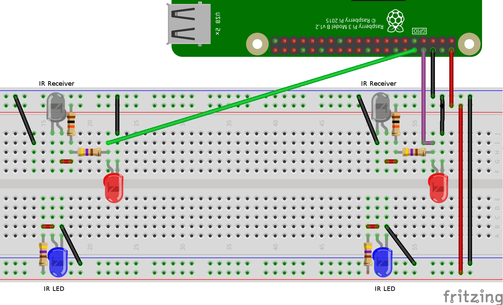

# Raspberry Pi + React Native + Foosball

## Features:

- Automatic goal detection and score keeping

## Setup

- Clone this repository

        git clone https://github.com/illing2005/raspberry-foosball

### Pusher.com

- Create an account at http://www.pusher.com

### Raspberry Pi:

- Copy the `raspberry-app` folder to your raspberry pi

- Rename `config.example.py` to `config.py`, add your pusher.com credentials, and adjust GPIO pin nubers.

- Run `python main.py`

### React Native:

- Rename `mobile-app/App/Config/config.example.js` to `mobile-app/App/Config/config.js` and add your pusher credentials.

- Install dependencies:

        cd mobile-app
        npm install

- Run App on emulator:

        react-native run-android
        npm run start

- See https://facebook.github.io/react-native/docs/signed-apk-android.html how to create an signed apk

### Hardware:

For the goal detection, you need two infrared light barriers (see sketch).
The red LED is for testing purposes only and can be removed.

Needed parts:

- IR Emitter and Reciever pairs (like these http://www.pollin.de/shop/dt/NzA0OTc4OTk-/Bauelemente_Bauteile/Aktive_Bauelemente/Optoelektronik/Infrarot_Lichtschranken_Paare_TEMIC_K153P.html)
- A few Resistors

